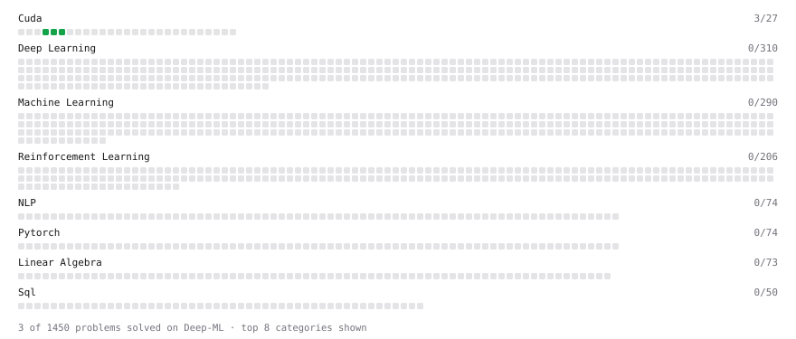

# Deep-ML

My machine learning practice from [Deep-ML](https://www.deep-ml.com). Every solution here was written by hand.

**6** solved · 6 problems · 0 labs · 0 math

[**Browse the interactive portfolio**](https://matteblack9.github.io/deep-ml/) to replay this filling in over time.

## Problems

| | Difficulty | Solved | |
| --- | --- | --- | --- |
| [Grid-Stride Loop: Square Each Element](https://www.deep-ml.com/problems/1205) | easy | 2026-09-25 | [solution](problems/1205-grid-stride-loop-square-each-element) |
| [ReLU Activation](https://www.deep-ml.com/problems/1204) | easy | 2026-09-25 | [solution](problems/1204-relu-activation) |
| [Scalar Multiply (a * x)](https://www.deep-ml.com/problems/1203) | easy | 2026-09-25 | [solution](problems/1203-scalar-multiply-a-x) |
| [Vector Addition](https://www.deep-ml.com/problems/1202) | easy | 2026-09-25 | [solution](problems/1202-vector-addition) |
| [Your First CUDA Kernel: Thread Index](https://www.deep-ml.com/problems/1201) | easy | 2026-09-25 | [solution](problems/1201-your-first-cuda-kernel-thread-index) |
| [Add Two Matrices (2D Grid)](https://www.deep-ml.com/problems/1206) | medium | 2026-09-25 | [solution](problems/1206-add-two-matrices-2d-grid) |

---

_This file is regenerated by Deep-ML on every push._
